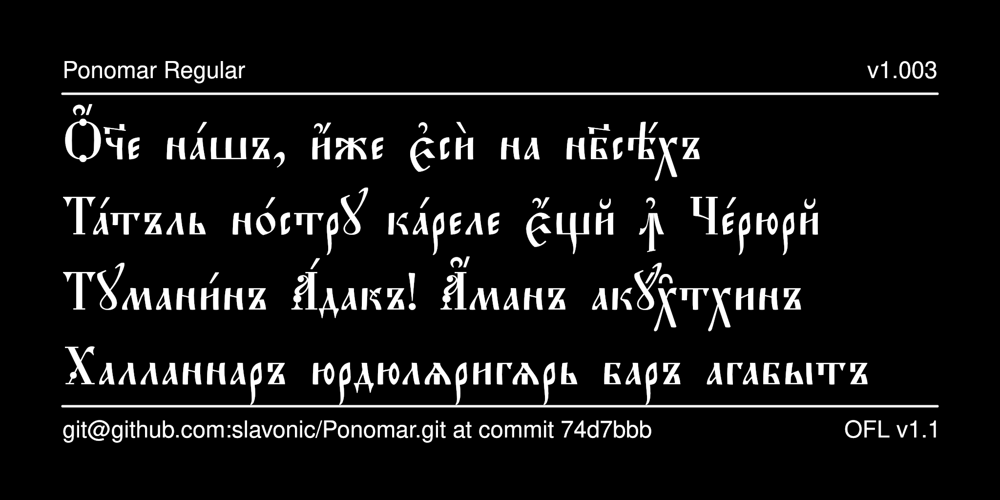

# Ponomar Typeface

Ponomar is a contemporary Church Slavonic font that reproduces the typeface used in editions published by the Synodal Press of the Russian Orthodox Church in the early twentieth century. It is presently used in various liturgical books published by the Moscow Patriarchate. It also contains characters needed to typeset liturgical texts in Romanian (Moldovan) Cyrillic, Aleut, and Sakha (Yakut).



## History

The font was originally designed by Vlad Dorosh as Hirmos UCS for
the [Irmologion project](http://irmologion.ru/fonts.html#hirmos).
It was then released under the LaTeX Project Public License
as part of [CSLTeX](https://sites.google.com/site/csltex/).
Next, it was reencoded for Unicode by Aleksandr Andreev
and Nikita Simmons and released as Hirmos Ponomar.
Finally, additional glyphs and OT features were added and the
font was released as Ponomar Unicode, as part of the
[Slavonic Computing Initiative](https://sci.ponomar.net/fonts.html), and under SIL OFL v. 1.1.
Edited by Aleksandr Andreev for Google Fonts.

## License

This Font Software is licensed under the SIL Open Font License,
Version 1.1. This license is available with a FAQ at
[https://openfontlicense.org/](https://openfontlicense.org/).

## Building the Fonts

The font is built using fontmake and gftools post processing script. Tools are all python based, so it must be previously installed.

To install all the Python tools into a virtualenv, do the following:

From terminal:

```

cd your/local/project/directory

#once in the project folder create a virtual environment. 
This step has to be done just once, the first time:

python3 -m venv venv

#activate the virtual environment

source venv/bin/activate

#install the required dependencies

pip install -r requirements.txt

```

Then run the this command:

```
cd sources
gftools builder config.yaml
```

The fonts are supposed to build automatically in the repository 
using GitHub Actions, but this does not work correctly 
for some reason.

## Features

* Stylistic Set 1 (*ss01*) changes the hyphen symbol (-) to an 
underscore (_), which is the default hyphenation symbol used
in Synodal Church Slavonic. This can be used for software such
as LibreOffice that does not support changing the default
hyphenation character.

* Stylistic Set 2 (*ss02*) provides blackletter forms of Latin
characters and ASCII digits. This is useful for setting text 
in English or other Western languages side-by-side with
Slavonic in some contexts.

* Stylistic Alternatives (*salt*) are provided for the following
characters:
  - an alternative form of capital wide yest (U+0404), used
  mostly for typesetting Ukrainian text stylized as Church Slavonic.
  - an alternative form of capital u (U+0423), that looks exactly
  like U+A64A (this is a feature of some publications)
  - an analagous alternative form of capital u with breve (U+040E)
  - eight alternative forms of the Symbol for Mark's Chapter (U+1F545)

* Three ligatures are available by inserting U+200D Zero Width Joiner:
  - Ligature A-U (U+0430 U+200D U+0443)
  - Ligature El-U (U+043B U+200D U+0443)
  - Ligature Te-Ve (U+0442 U+200D U+0432)

See your software's documentation about how to access these glyphs.

As well, a number of glyphs are available in the Private Use Area.
The most relevant of these are duplicates of the Typicon symbols
U+1F540 through U+1F545 available at U+F400 through U+F405. This is
useful in some applications that do not support the Unicode SMP.

## More Church Slavonic Fonts

See the [main repository](https://github.com/typiconman/fonts-cu/issues) and the [website](https://sci.ponomar.net/fonts.html).
